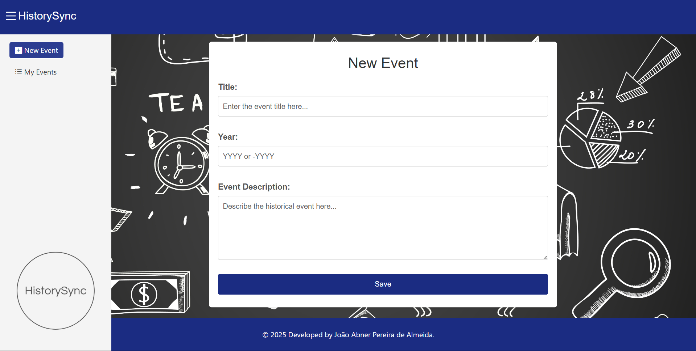
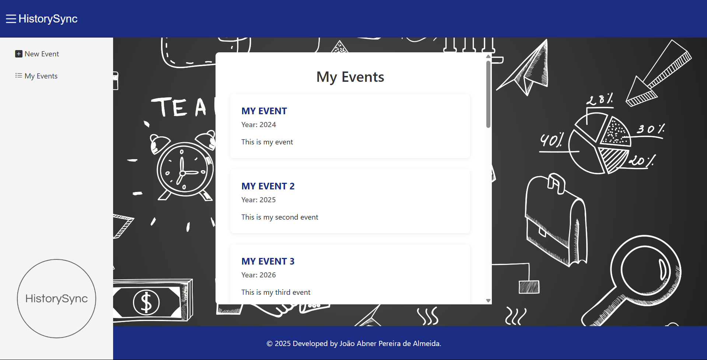
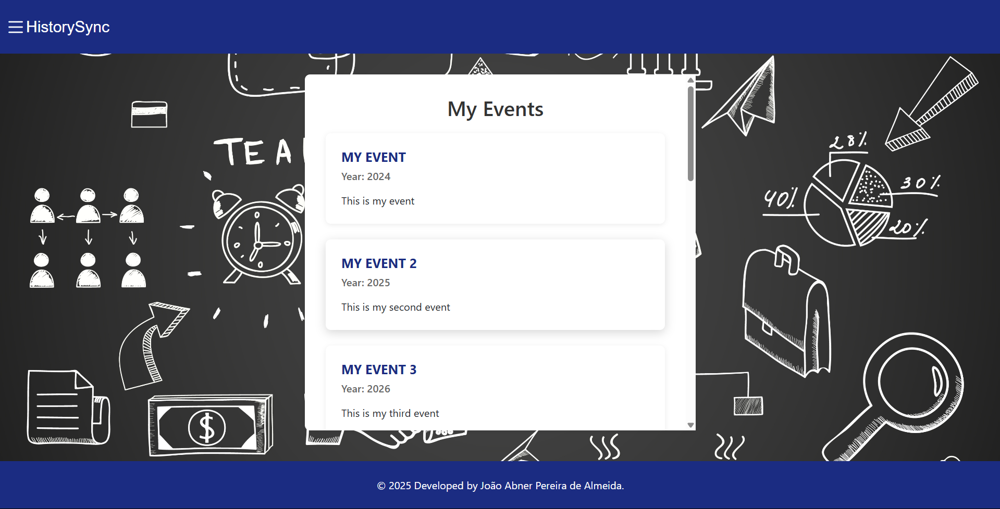

# history-sync - Gerenciamento de Eventos Históricos

- Identificação/Autor: João Abner Pereira de Almeida.
- Descrição do projeto: A aplicação é sobre organizar e mostrar eventos importantes da história.
- Prototipação no Figma: https://www.figma.com/design/fPd7TJurYzAqUGI1rGBsaf/Gerenciamento-de-Eventos-Hist%C3%B3ricos?node-id=0-1&t=GO3LjMbKO5lXzGwi-1
- Design System: https://docs.google.com/document/d/1sBL56EcXLFpoxfQ5g4eEiOSS8GxE3r-Fw6YJ5HnrFS0/edit?usp=sharing
- Framework CSS: Bootstrap 5.3.3
- Dependências, Lista das bibliotecas JavaScript utilizadas:
  - [Angular 18.2](https://angular.io/) (`@angular/animations`, `@angular/common`, `@angular/compiler`, `@angular/core`, `@angular/forms`, `@angular/platform-browser`, `@angular/platform-browser-dynamic`, `@angular/router`)
  - [Bootstrap 5.3.3](https://getbootstrap.com/)
  - [Bootstrap Icons 1.11.3](https://icons.getbootstrap.com/)
  - [RxJS 7.8](https://rxjs.dev/)
  - [Zone.js 0.14](https://github.com/angular/zone.js/)
  - [TSLib 2.3](https://github.com/microsoft/tslib)
  - [@types/bootstrap 5.2.10](https://www.npmjs.com/package/@types/bootstrap) (tipagens para Bootstrap)
- Link para o site em produção: URL para acessar o site publicado no GitHub Pages.
- Checklist de Funcionalidades: Uma lista de funcionalidades marcadas como concluídas (ou não) durante o desenvolvimento.

## Checklist | Indicadores de Desempenho (ID) dos Resultados de Aprendizagem (RA)

### RA1 - Prototipar e projetar interfaces gráficas de usuário, considerando princípios de usabilidade e experiência do usuário.

- [ ] **ID1:** Desenvolver protótipos de interfaces que demonstram compreensão das diretrizes de usabilidade.
- [ ] **ID2:** Projetar interfaces responsivas que se adaptam a diferentes tamanhos de tela.

### RA2 - Criar e reutilizar componentes em frameworks frontend, desenvolvendo interfaces modulares, responsivas e estilizadas.

- [ ] **ID3:** Desenvolver componentes reutilizáveis e que se adaptem de maneira responsiva em vários tamanhos de tela.
- [ ] **ID4:** Incorporar componentes de frameworks CSS.
- [ ] **ID5:** Aplicar diretivas estruturais para exibir ou ocultar elementos de forma condicional.
- [ ] **ID6:** Utilizar diretivas estruturais para repetir elementos de interface de maneira dinâmica, a fim de criar listas, galerias ou outras visualizações baseadas em conjuntos de dados.
- [ ] **ID7:** Aplicar Pipes para formatar a apresentação de dados.

### RA3 - Sincronizar dados entre a interface gráfica e o modelo de dados, aplicando técnicas de binding para manter a consistência.

- [ ] **ID8:** Aplicar técnicas de one-way data binding, como Interpolation e Property Binding, para exibir e atualizar dados na interface gráfica de maneira unidirecional.
- [ ] **ID9:** Aplicar técnicas de event binding para capturar eventos do usuário na interface e interagir com o modelo de dados.
- [ ] **ID10:** Aplicar técnicas de two-way data binding para criar uma sincronização bidirecional automática entre a interface e o modelo de dados.
- [ ] **ID11:** Usar variáveis de template para manipulação dinâmica dos dados na interface gráfica.

### RA4 - Implementar comunicação eficaz entre componentes, utilizando padrões de comunicação e serviços para compartilhar lógica e dados.

- [ ] **ID12:** Criar comunicação entre componentes não relacionados hierarquicamente por meio de serviços através do mecanismo de injeção de dependência.
- [ ] **ID13:** Utilizar as diretivas @Input ou @Output para comunicação em uma hierarquia de componentes.

### RA5 - Criar interfaces de navegação intuitivas e responsivas, implementando roteamento em aplicações de página única (SPA).

- [ ] **ID14:** Configurar rotas para diferentes partes da aplicação, permitindo a navegação entre páginas distintas.
- [ ] **ID15:** Passar dados entre componentes que representam diferentes telas usando parâmetros de rotas.
- [ ] **ID16:** Criar uma estrutura de navegação aninhada para representar hierarquias de conteúdo.
- [ ] **ID17:** Aplicar guardas de rotas para controlar o acesso a rotas específicas da aplicação, assegurando que somente usuários autorizados possam acessar determinadas partes da interface.

### RA6 - Realizar requisições assíncronas para serviços web, compreendendo os protocolos e formatos de troca de dados, tratando respostas e erros.

- ~~[ ] **ID18:** Fazer requisições assíncronas a uma API pública para no mínimo a operação GET.~~
- [ ] **ID19:** Fazer requisições assíncronas a uma API simulada/fake para as operações GET, POST, PUT, PATCH e DELETE.
- [ ] **ID20:** Tratar respostas de sucesso e erros das requisições assíncronas.
- [ ] **ID21:** Aplicar validações de entrada nos campos do formulário, utilizando técnicas como expressões regulares (REGEX), e apresentar mensagens de erro claras e informativas para auxiliar os usuários a corrigir entradas incorretas.
- [ ] **ID22:** Desabilitar adequadamente o botão de submit enquanto o formulário conter campos inválidos, evitando a submissão de dados incorretos.
- [ ] **ID23:** Utilizar Promises para tratar respostas assíncronas.
- [ ] **ID24:** Utilizar Observables para tratar respostas assíncronas.

### RA7 - Gerenciar o código-fonte de maneira eficiente, implementar boas práticas de controle de versão e colaborar em projetos de desenvolvimento.

- [ ] **ID25:** Criar um repositório no GitHub utilizando a estrutura do Gitflow, estabelecendo as branches "main" e "develop".
- [ ] **ID26:** Colaborar com outros membros do projeto, realizando fusões (merges) e resolução de conflitos.
- [ ] **ID27:** Planejar, configurar e executar o processo de build da aplicação, preparando-a para produção e realizar o deploy em um ambiente de hospedagem.

## Instruções de Execução: Passos detalhados para configurar e executar a aplicação localmente.

### Pré-requisitos

- **Node.js** (recomendado: versão 18.x ou superior)
- **npm** (geralmente já vem com o Node.js)
- **Angular CLI** (versão 18.x)
  ```bash
  npm install -g @angular/cli@18
  ```
- **JSON Server** (para simular a API fake)
  ```bash
  npm install -g json-server
  ```

> Este projeto utiliza o Angular na versão 18.2. Certifique-se de instalar a mesma versão do Angular CLI para garantir compatibilidade.

### Passos para Configurar e Executar o Projeto:

1.  **Clonar o Repositório:**
    Abra seu terminal e clone o projeto:

    ```bash
    git clone https://github.com/Joao-Abner/history-sync.git
    ```

2.  **Acessar o Projeto:**
    Navegue para a pasta recém-clonada do projeto. Este será o diretório raiz onde você executará todos os comandos:

    ```bash
    cd history-sync
    # Ou 'cd nome-da-pasta-que-voce-deu-ao-clonar'
    ```

3.  **Fazer Checkout na Branch `dev`:**
    A branch de desenvolvimento principal é a `dev`. Certifique-se de estar nela:

    ```bash
    git checkout dev
    ```

4.  **Instalar as Dependências:**
    Na raiz do projeto, instale todas as dependências necessárias:

    ```bash
    npm install
    ```

5.  **Executar a API Fake (JSON Server):**
    Para simular o backend, você precisará iniciar a API fake em um terminal **separado**.

    - **Via script do `package.json` (recomendado):**
      ```bash
      npm run json-server
      ```
    - **Ou, manualmente (se preferir):**
      Certifique-se de ter o `json-server` instalado (`npm install -g json-server`). Depois, execute na raiz do projeto:
      ```bash
      json-server --watch db.json --port 3000
      ```
    - A API estará acessível em: `http://localhost:3000`

6.  **Executar o Projeto Angular:**
    Abra um **novo terminal** na raiz do projeto e inicie o aplicativo Angular:
    ```bash
    ng serve -o
    ```
    Isso iniciará o servidor de desenvolvimento e abrirá o projeto no seu navegador padrão (`http://localhost:4200/`).

- ## Telas da Aplicação:
  
  
  
  
